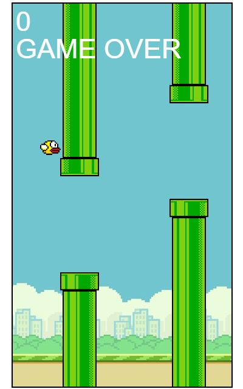

  

## 🖥️ Projeto

O projeto é um jogo, chamado Flappy Bird, onde o usuário poderá clicar, pressionar as teclas de espaço ou seta para cima para não deixar o pássaro tocar os obstáculos.

## 🚀 Tecnologias

Esse projeto foi desenvolvido com as seguintes tecnologias:

- HTML
- CSS
- JAVASCRIPT
- GIT e GITHUB
